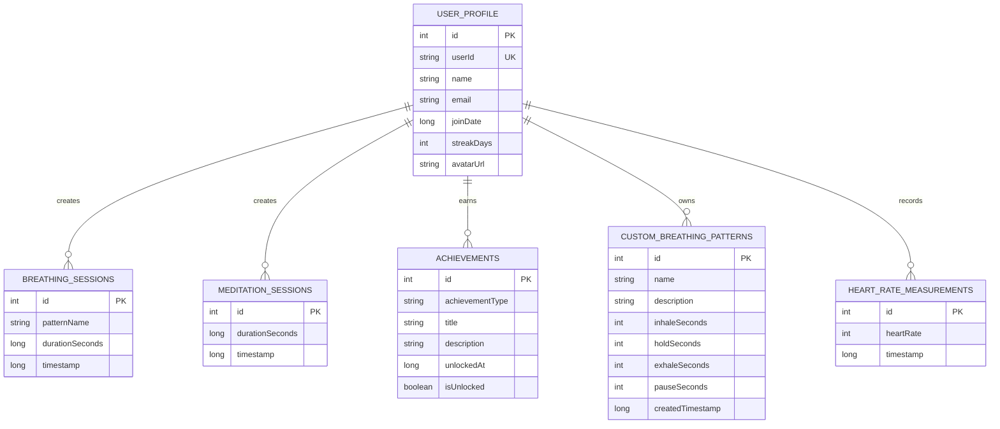

# Структура базы данных SpyBrain

## Обзор

SpyBrain использует **Room Database** для локального хранения данных. База данных построена на SQLite и обеспечивает надежное хранение пользовательских данных, сессий медитации и дыхания, достижений и настроек.

**Текущая версия БД**: 4  
**Основные компоненты**: Room Database, TypeConverters, DAOs, Entities

## Схема базы данных



## Описание таблиц

### 1. user_profile
Хранит основную информацию о пользователе приложения.

| Поле | Тип | Описание | Ограничения |
|------|-----|----------|-------------|
| id | INTEGER | Первичный ключ | PRIMARY KEY, DEFAULT 0 |
| userId | TEXT | Уникальный идентификатор пользователя | NOT NULL |
| name | TEXT | Имя пользователя | NOT NULL |
| email | TEXT | Email адрес | NOT NULL |
| joinDate | INTEGER | Дата регистрации (timestamp) | NOT NULL |
| streakDays | INTEGER | Количество дней подряд использования | NOT NULL, DEFAULT 0 |
| avatarUrl | TEXT | URL аватара пользователя | NULLABLE |

### 2. breathing_sessions
Записи о проведенных сессиях дыхательных практик.

| Поле | Тип | Описание | Ограничения |
|------|-----|----------|-------------|
| id | INTEGER | Первичный ключ | PRIMARY KEY AUTOINCREMENT |
| patternName | TEXT | Название паттерна дыхания | NOT NULL |
| durationSeconds | INTEGER | Длительность сессии в секундах | NOT NULL |
| timestamp | INTEGER | Время проведения сессии | NOT NULL |

### 3. meditation_sessions
Записи о проведенных медитациях.

| Поле | Тип | Описание | Ограничения |
|------|-----|----------|-------------|
| id | INTEGER | Первичный ключ | PRIMARY KEY AUTOINCREMENT |
| durationSeconds | INTEGER | Длительность медитации в секундах | NOT NULL |
| timestamp | INTEGER | Время проведения медитации | NOT NULL |

### 4. custom_breathing_patterns
Пользовательские паттерны дыхания.

| Поле | Тип | Описание | Ограничения |
|------|-----|----------|-------------|
| id | INTEGER | Первичный ключ | PRIMARY KEY AUTOINCREMENT |
| name | TEXT | Название паттерна | NOT NULL |
| description | TEXT | Описание паттерна | NULLABLE |
| inhaleSeconds | INTEGER | Длительность вдоха в секундах | NOT NULL |
| holdSeconds | INTEGER | Длительность задержки дыхания | NOT NULL |
| exhaleSeconds | INTEGER | Длительность выдоха | NOT NULL |
| pauseSeconds | INTEGER | Пауза между циклами | NOT NULL |
| createdTimestamp | INTEGER | Время создания паттерна | NOT NULL |

### 5. achievements
Достижения пользователя.

| Поле | Тип | Описание | Ограничения |
|------|-----|----------|-------------|
| id | INTEGER | Первичный ключ | PRIMARY KEY AUTOINCREMENT |
| achievementType | TEXT | Тип достижения | NOT NULL |
| title | TEXT | Название достижения | NOT NULL |
| description | TEXT | Описание достижения | NOT NULL |
| unlockedAt | INTEGER | Время получения достижения | NULLABLE |
| isUnlocked | INTEGER | Флаг разблокировки (0/1) | NOT NULL, DEFAULT 0 |

### 6. heart_rate_measurements
Измерения пульса пользователя.

| Поле | Тип | Описание | Ограничения |
|------|-----|----------|-------------|
| id | INTEGER | Первичный ключ | PRIMARY KEY AUTOINCREMENT |
| heartRate | INTEGER | Значение пульса (уд/мин) | NOT NULL |
| timestamp | INTEGER | Время измерения | NOT NULL |

## TypeConverters

```kotlin
class Converters {
    @TypeConverter
    fun fromTimestamp(value: Long?): Date? {
        return value?.let { Date(it) }
    }

    @TypeConverter
    fun dateToTimestamp(date: Date?): Long? {
        return date?.time
    }
}
```

## DAO интерфейсы

### BreathingSessionDao
```kotlin
@Dao
interface BreathingSessionDao {
    @Query("SELECT * FROM breathing_sessions ORDER BY timestamp DESC")
    fun getAllSessions(): Flow<List<BreathingSessionEntity>>
    
    @Insert
    suspend fun insertSession(session: BreathingSessionEntity)
    
    @Delete
    suspend fun deleteSession(session: BreathingSessionEntity)
}
```

### MeditationSessionDao
```kotlin
@Dao
interface MeditationSessionDao {
    @Query("SELECT * FROM meditation_sessions ORDER BY timestamp DESC")
    fun getAllSessions(): Flow<List<MeditationSessionEntity>>
    
    @Insert
    suspend fun insertSession(session: MeditationSessionEntity)
}
```

### UserProfileDao
```kotlin
@Dao
interface UserProfileDao {
    @Query("SELECT * FROM user_profile WHERE id = 0")
    fun getUserProfile(): Flow<UserProfileEntity?>
    
    @Insert(onConflict = OnConflictStrategy.REPLACE)
    suspend fun insertOrUpdateProfile(profile: UserProfileEntity)
}
```

### CustomBreathingPatternDao
```kotlin
@Dao
interface CustomBreathingPatternDao {
    @Query("SELECT * FROM custom_breathing_patterns ORDER BY createdTimestamp DESC")
    fun getAllPatterns(): Flow<List<CustomBreathingPatternEntity>>
    
    @Insert
    suspend fun insertPattern(pattern: CustomBreathingPatternEntity): Long
    
    @Delete
    suspend fun deletePattern(pattern: CustomBreathingPatternEntity)
}
```

### HeartRateDao
```kotlin
@Dao
interface HeartRateDao {
    @Query("SELECT * FROM heart_rate_measurements ORDER BY timestamp DESC LIMIT :limit")
    suspend fun getRecentMeasurements(limit: Int): List<HeartRateMeasurement>
    
    @Insert
    suspend fun insertMeasurement(measurement: HeartRateMeasurement)
}
```

## Миграции

### Миграция 1 → 2
Добавление таблицы custom_breathing_patterns.

```kotlin
val MIGRATION_1_2 = object : Migration(1, 2) {
    override fun migrate(database: SupportSQLiteDatabase) {
        database.execSQL("""
            CREATE TABLE IF NOT EXISTS custom_breathing_patterns (
                id INTEGER PRIMARY KEY AUTOINCREMENT NOT NULL,
                name TEXT NOT NULL,
                description TEXT,
                inhaleSeconds INTEGER NOT NULL,
                holdSeconds INTEGER NOT NULL,
                exhaleSeconds INTEGER NOT NULL,
                pauseSeconds INTEGER NOT NULL,
                createdTimestamp INTEGER NOT NULL
            )
        """)
    }
}
```

### Миграция 2 → 3
Добавление таблицы achievements.

```kotlin
val MIGRATION_2_3 = object : Migration(2, 3) {
    override fun migrate(database: SupportSQLiteDatabase) {
        database.execSQL("""
            CREATE TABLE IF NOT EXISTS achievements (
                id INTEGER PRIMARY KEY AUTOINCREMENT NOT NULL,
                achievementType TEXT NOT NULL,
                title TEXT NOT NULL,
                description TEXT NOT NULL,
                unlockedAt INTEGER,
                isUnlocked INTEGER NOT NULL DEFAULT 0
            )
        """)
    }
}
```

### Миграция 3 → 4
Добавление таблицы heart_rate_measurements.

```kotlin
val MIGRATION_3_4 = object : Migration(3, 4) {
    override fun migrate(database: SupportSQLiteDatabase) {
        database.execSQL("""
            CREATE TABLE IF NOT EXISTS heart_rate_measurements (
                id INTEGER PRIMARY KEY AUTOINCREMENT NOT NULL,
                heartRate INTEGER NOT NULL,
                timestamp INTEGER NOT NULL
            )
        """)
    }
}
```

## Примеры использования

### Сохранение дыхательной сессии
```kotlin
val session = BreathingSessionEntity(
    patternName = "4-7-8 Breathing",
    durationSeconds = 300,
    timestamp = System.currentTimeMillis()
)
breathingSessionDao.insertSession(session)
```

### Получение статистики медитаций
```kotlin
meditationSessionDao.getAllSessions()
    .map { sessions ->
        sessions.groupBy { 
            SimpleDateFormat("yyyy-MM-dd").format(Date(it.timestamp))
        }
    }
    .collect { dailySessions ->
        // Обработка статистики по дням
    }
```

### Создание пользовательского паттерна дыхания
```kotlin
val customPattern = CustomBreathingPatternEntity(
    name = "Мой паттерн",
    description = "Персональная техника дыхания",
    inhaleSeconds = 4,
    holdSeconds = 4,
    exhaleSeconds = 6,
    pauseSeconds = 2,
    createdTimestamp = System.currentTimeMillis()
)
customBreathingPatternDao.insertPattern(customPattern)
```

## Оптимизация и индексы

Для улучшения производительности рекомендуется добавить индексы:

```kotlin
@Entity(
    tableName = "breathing_sessions",
    indices = [Index("timestamp")]
)

@Entity(
    tableName = "meditation_sessions",
    indices = [Index("timestamp")]
)

@Entity(
    tableName = "heart_rate_measurements",
    indices = [Index("timestamp")]
)
```

## Резервное копирование

Приложение поддерживает автоматическое резервное копирование через Android Backup Service. Конфигурация в `backup_rules.xml`:

```xml
<full-backup-content>
    <include domain="database" path="spybrain.db"/>
    <exclude domain="database" path="spybrain.db-wal"/>
    <exclude domain="database" path="spybrain.db-shm"/>
</full-backup-content>
```

## Безопасность

- Все чувствительные данные должны шифроваться перед сохранением
- Используйте SQLCipher для шифрования всей базы данных
- Регулярно очищайте устаревшие данные
- Не храните пароли в открытом виде

## Будущие улучшения

1. **Синхронизация с облаком**: Добавить поддержку синхронизации данных между устройствами
2. **Экспорт данных**: Реализовать экспорт статистики в CSV/JSON
3. **Архивация старых данных**: Автоматическое архивирование данных старше года
4. **Полнотекстовый поиск**: Добавить FTS для поиска по медитациям
5. **Аналитика**: Добавить таблицы для детальной аналитики использования
